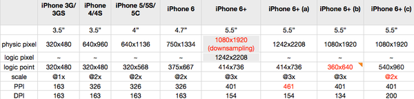

* 版权声明： 自由转载-非商用-非衍生-保持署名[创意共享3.0许可证](https://creativecommons.org/licenses/by-nc-nd/3.0/deed.zh)
* 创建日期：2017-8-23
* 社交媒体：[twitter](https://twitter.com)[weibo](http://weibo.com/2630232391/profile?topnav=1&wvr=6)
# js前端自动化工程
# react-router 4.0

* Router(low-level)
* HashRouter(high-level)
* BrowserRouter(high-level)
* MemoryRouter(high-level)
* NativeRouter(high-level)
* StaticRouter(high-level)

## react-loadable(高阶组件，用于动态载入组件，会处理大部分极端情况)   

## 第一次异步数据接通的思考：

    reducers直接配置到rootReducer，并未进行code splitting，只有UI部分进行了 code splitting。
    
    思考：如何将对应的reducers进行code splitting。
## 元素的宽高
* client***系列：`content+padding+css width(标准盒模型情况下)`

        clientWidth：内容可视宽度（包括padding）
        clientHeight：内容可视高度（包括padding）
        clientTop：border-top的宽度
        clientLeft：border-left的宽度
* offset***系列：`content+padding+scrollbar+css width（标准盒模型情况下）,已经验证`

        offsetWidth：元素占用的空间，包括border，padding，scrollbar，content等内容。(HTMLElement.offWidth read-only property is a measurement which includes the element borders,horizontal padding,the element vertical scrollbar(if present,if rendered) and the css width.)
        offsetHeight：元素占用的空间，包括border，padding，scrollbar，content等内容
        ，margin是看不到的。(HTMLElement.offsetHeight read-only property is the height of the element including vertical padding,borders and the element horizontal scrollbar(if present,if rendered), as an integer.)
        offsetParent：positioned：返回最近定位元素的引用；non-positioned： 返回table,table-cell,html(标准模式),body(怪异模式),null(display:none)
        offsetTop：返回当前元素相对于offsetParent顶部的距离
        offsetLeft：返回当前元素相对于offsetParent左边的距离
* scroll***系列：`content+padding+scrollMaxLength`

        scrollWidth：实际内容宽度
        scrollHeight：实际内容高度
        scrollTop：0~max(最大可滚动距离)
        scrollLeft：0-max(最大可滚动距离)
* element.getBoundingClientRect()：返回元素相对于viewport的size

        chrome在使用该函数时，如果遇到img标签不指定高度，计算数据top不正确；
        firefox在使用该函数时，如果遇到img标签不指定高度，第一次计算数据不正确，刷行可以计算出正确数据。
* element.getClientRects()
## window窗口
* 版本信息：

        chrome：版本 59.0.3071.115（正式版本）（64 位）
        ie：11.0.45
        opera：47.0.2631.71 (PGO) - Opera 为最新版本
        firefox：55.0.3（32位）
* 窗口相对于屏幕的位置：(无法跨浏览器获取窗体位置)

        全屏条件下测试结果：
        chrome，opera        
        screenLeft：0
        screenTop：0
        screenX：0
        screenY：0
        IE        
        screenLeft：0
        screenTop：55
        screenX：-8
        screenY：-8
        firefox        
        screenLeft：undefined
        screenTop：undefined
        screenX：-8
        screenY：-8
        ```
        let top = 0;
        if (typeof screenTop === 'number'){
                top = screenTop;
        }
        else{
                top = screenY;
        }
        ```
* 窗口大小也无法跨浏览器获取，但视口（viewport）可以统一获取，派生于element的元素都有client***属性

        innerWidth
        innerHeight
        outerWidth
        outerHeight
        document.documentElement.clientWidth（viewport）
        document.documentElement.clientHeight（viewport）
        document.body.clientWidth
        document.body.clientHeight
        通过对比这几个值在四个浏览器中的值，inner***包括滚动条宽度，outer***是窗体大小，client***是viewport大小，且viewport+scrollbar = inner***，且scrollbar宽度是17px。
# 移动端知识点
* 单位：

        绝对单位：cm,pt是物理长度，1cm=0.01m,1pt=1/72inch,1inch=2.54cm
        相对单位：rem,em,ex等都是相对单位。
* dp(device pixel,设备像素，设备分辨率，物理分辨率，屏幕实际分辨率)：

        实际显示的最小物理单元，该物理单元度量单位使用pt。显示器出厂时就决定了物理尺寸以及对应的设备像素。
        其实就是使用了相对单位度(物理像素)量屏幕大小。
* dip(device-independent pixel,设备独立/无关像素,逻辑分辨率,逻辑点logic point):

        计算机坐标系统中的点,该点代表了一个可由程序使用并控制的虚拟像素,然后由系统转换成对应的物理像素。
        在移动设备中，screen.width/height获取的就是dip而不是dp。
* dpr(device pixel ratio,设备像素比)：

        dpr = dp/dip即设备像素与设备独立像素的比值（在x方向或y方向），意味着一个逻辑点对应着着几个物理像素。


* ppi(pixel per inch)：

        像素密度，每英寸屏幕所拥有的像素数。用来描述屏幕显示密度，越大显示越清晰。
* dpi(dot per inch)：

        点密度，用来描述打印机打印密度，越大打印出来的越清晰。
        在屏幕上，可以用来描述逻辑ppi，即单位英寸内的逻辑像素。直接描述编程时使用的px对应的物理尺寸。
* 总结：

        dp：描述屏幕的大小，用物理像素度量。
        ppi：描述的屏幕的像素密度，越大显示越无颗粒感。
* [参考资料](https://www.zhihu.com/question/25361043)
[](https://www.zhihu.com/question/25361043)
# js类层次关系
* node
* node-->Document
* node-->DocumentType
* node-->Document
* node-->Element
* node-->Attr
* node-->CDataSection
* node-->
* node-->
# test for git log
# 建立新分支monkey_mm
# test for git rebase
# feature-addlog
# feature-add1
# feature-add2
# feature-add3
