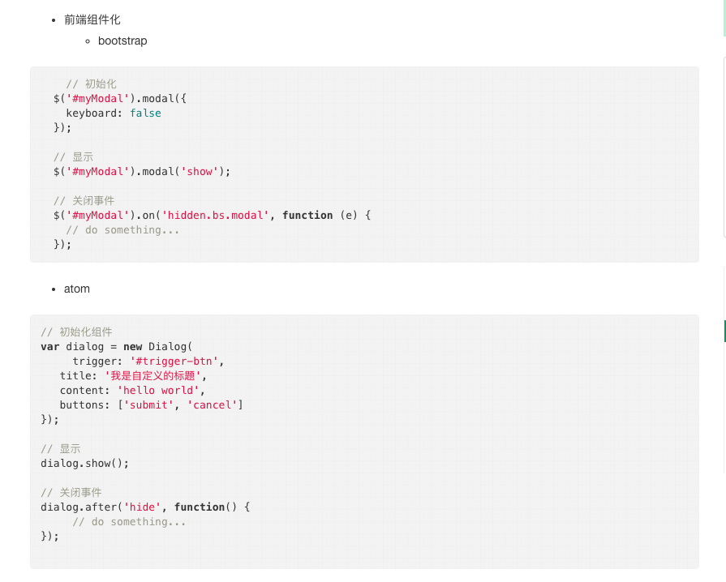
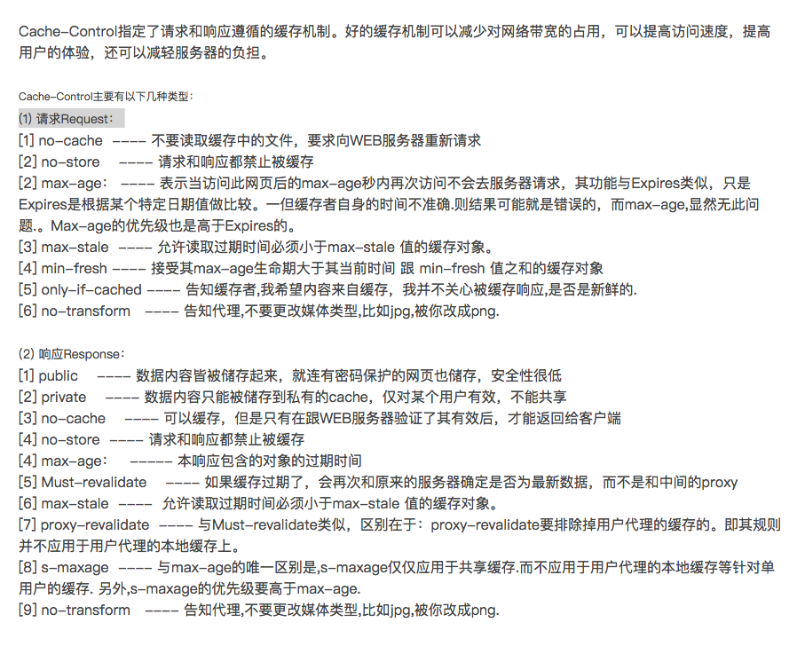

* 版权声明： 所有内容-自由转载-非商用-非衍生-保持署名[创意共享3.0许可证](https://creativecommons.org/licenses/by-nc-nd/3.0/deed.zh)-代码遵循[MIT许可协议](https://mit-license.org/)
* 邮箱：334080374@qq.com
* 创建日期：2017-8-23
* 社交媒体：[twitter](https://twitter.com)[weibo](http://weibo.com/2630232391/profile?topnav=1&wvr=6)
# js前端自动化工程
## 关于注释(widgets统一使用该signature)
```
/**
 * @name:      First index
 * @author:     Monkey
 * @email:      334080374@qq.com
 * @date:       2017-8-23
 * @modify Date:
 * @function:   
 */
```
## 关于环境env，相关环境有
* `开发环境development`
* `测试环境test`
* `预发环境pre、bata`
* `生产环境production`
* `问题1`
```
webpack打包：
webpack中import的本质是什么？代码拷贝？
文件a.js和b.js，如果c.js和d.js文件都引用了a.js和b.js，如何处理？
```
## react-router 4.0

* Router(low-level)
* HashRouter(high-level)
* BrowserRouter(high-level)
* MemoryRouter(high-level)
* NativeRouter(high-level)
* StaticRouter(high-level)
## react-loadable(高阶组件，用于动态载入组件，会处理大部分极端情况)   
## [redux](http://redux.js.org/docs/api/index.html)
* Top-level api

        createStore(reducer, [preloadedState], [enhancer]);
        combineReducers(reducers);
        applyMiddleware(...middlewares);
        bindActionCreators(actionCreators, dispatch);
        compose(...functions);
* Store API

        getState()
        dispatch(action)
        subscribe(listener)
        replaceReducer(nextReducer)
## [开源协议](http://www.oschina.net/news/74999/how-to-choose-a-license)
* LGPL,Lesser General Public License（较宽松公共许可证）,
        Library General Public License（函数库公共许可证）,适用自由软件基金会（FSF，Free Software Foundation）
* GPL
* MPL,The Mozilla Public License,是Netscape的Mozilla小组为其开源软件项目设计的软件许可证。
* BSD
* MIT
* Apache
## 组件化

        写在前面的话，技术的改革是为了提高生产效率。
        提高效率面临的问题：
        1、解决协同开发的问题，提高代码的内聚性，降低耦合性。（模块化、组件化、文档化、版本控制、代码合并）
        2、合理的组织代码结构，提高代码的可读性和维护性。
        3、独立发布，降低项目之间的依赖
* [Web Component是什么？它为什么对我们这么重要？](http://www.html-js.com/article/2779)

        文章里面有一句话：
        WebComponents是通过一种标准化的非侵入的方式封装一个组件，每个组件能组织好它自身的HTML结构、
        CSS样式、JavaScript代码，并且不会干扰页面上的其他代码。

        我的理解：组件化就是为了更好更安全的使用已存在的代码。
* 什么是组件？---把图形、非图形的各种逻辑均抽象为一个统一的概念（组件）__[知乎，张立理](https://www.zhihu.com/question/29735633)
        
        我的疑问：
                1、组件化是为了重用代码吗？
                  http://www.html-js.com/article/2779这篇文章佐证了web component就是为了提高代码的可重用行。
                  如果要重用代码，真正的组件会封装各种业务逻辑吗？如果封装了业务逻辑，还能重用嘛？
                2、组件主要是为了提高代码的内聚性，降低代码耦合性吗？
                  如果是提高内聚性，降低耦合行，js的模块化不是已经解决了该问题（即解决了协作的问题）吗？

        我的理解：组件就是一组可重用代码。
* 为什么要组件?
        


        统一组件引入标准、减少轮子、降低引入风险

* 什么是组件化开发？---把图形、非图形的各种逻辑抽象为一个统一的概念（组件）来实现开发的模式。__[知乎，张立理](https://www.zhihu.com/question/29735633)

* [组件、控件、插件](http://blog.csdn.net/haiross/article/details/22662635)
## 第一次异步数据接通的思考：

    reducers直接配置到rootReducer，并未进行code splitting，只有UI部分进行了 code splitting。
    
    思考：如何将对应的reducers进行code splitting。
## mongodb要点

        涉及的两个点：mongo没有链接，查询多个集合数据需要多次查询。

        范式化：将数据分散到不同的集合，多个集合之间可以互相引用，这样修改数据时，只需要修改数据所在文档即可。即写一次，读多次。

        反范式化：每个文档所需要的数据都存储在文档内部，每个文档都拥有自己的数据副本。如果要修改这部分数据，需要修改这块数据对应的每一个文档。即写多次，读一次。

        非关系行数据库更适合处理关系简单的逻辑！！！
## Linux部分知识
* drwxrwxrwx:

        d标识文件类型，d：目录文件；l：链接文件；-：普通文件；p：管道；c：字符型设备；b：块设备；n：网络设备
        2-4位：表示这个文件的所有者（user）拥有的权限；
        5-7位：表示这个文件的所有者所在组（group）的权限；
        8-10位：表示其它用户（other）所具有的权限；
        r：文件读权限；w：文件写权限；x：文件执行权限；-：无权限
        --- 000 0
        --x 001 1
        -w- 010 2
        -wx 011 3
        r-- 100 4
        r-x 101 5
        rw- 110 6
        rwx 110 7
        rwxrwxrwx------->777
        查看文件权限：ls -la
        修改权限: chmod 760 filename；chmod o+r filename ...
        修改归属: chown
## 浏览器缓存知识
* 缓存命中（cache hit）
* 缓存未命中（cache miss）
* 再验证（revalidation）
* 再验证命中（revalidation hit）
* 浏览器缓存对缓存对象的副本进行再验证，会向原始服务器发送一个小的再验证请求。`实体标签`和`最近修改时间`是用来对已经缓存对象进行`验证工具`
* 浏览器会自动缓存get请求,Cache-Control、`实体标签`、`最近修改时间`
```
第一次请求：
请求头：
        Cache-Control: no-cache;
响应头：
        Cache-Control: public,max-age=0
        ETag: W/"hash值"
        Last-Modified: Tue, 21 Mar 2017 11:51:33 GMT
第二次请求：
请求头：
        If-Modified-Since: Tue, 21 Mar 2017 11:51:33 GMT
        If-None-Match: W/"hash值"
响应头：
        Cache-Control: public, max-age=0
        Last-Modified: Tue, 21 Mar 2017 11:51:33 GMT
        ETAG: W/"hash值"
```
* Cache-Control(1.1 max-age)和Expires(1.0)首部指定过期日期，这两个是响应首部，只有当缓存到期了，才需要进行再验证。
```
Cache-Control: max-age，使用的是相对日期，http1.1 0表示每次都要请求服务器，有效时长
Cache-Control: s-maxage，使用的是相对日期，http1.1
Cache-Control: max-stable=s，缓存可以提供随意过期的文件；如果指定参数s，在这段时间内，文档就不能过期
Cache-Control: min-fresh=s
Cache-Control: no-Store，缓存应该尽快从存储器中删除文档的所有痕迹
Cache-Control: no-Cache，缓存需要经过新鲜度验证，才能提供缓存给UA
Cache-Control: must-revalidate，
Expires: 指定过期日期
```

## 遇到的新鲜
* web beacon,即web bug，主要用于追踪信息，用于数据统计。使用express实现了一把，获取web bug所在页面，以及用户的userAgent

        二十加冠，
        三十而立，
        四十不惑，
        五十知天命，
        六十耳顺，
        七十古稀，
        八十、九十耄耋，
        一百期颐
